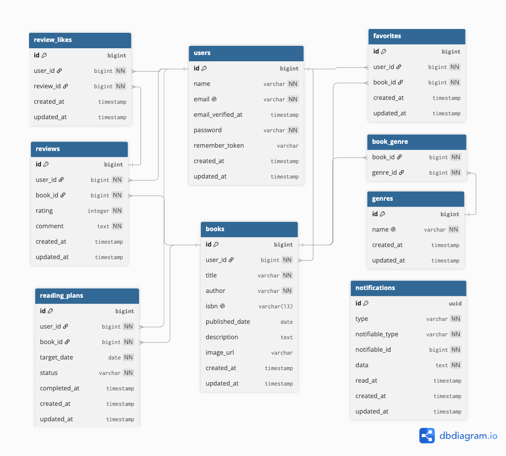

# BookShelf 書籍レビューアプリ

書籍の登録やレビュー、読書計画をまとめて管理できるWebアプリケーションです。

## 概要

本アプリケーションでは、書籍情報の登録・検索、レビュー投稿、お気に入り登録、読書計画の管理ができます。

Google Books APIを利用したISBN検索に加え、書籍ランキング、読書レポート、期限に応じたリマインダー通知など、読書を継続的に管理するための機能を実装しています。

また、外部アプリケーションから書籍情報を操作できるJSON APIを提供しています。

### 主な機能

#### Webアプリケーション

- 会員登録・ログイン・ログアウト
- 書籍一覧・詳細表示
- 書籍の登録・編集・削除
- 書籍のキーワード検索・ジャンル絞り込み
- 書籍の並び替え・ページネーション
- Google Books APIを利用したISBN検索
- レビューの投稿・編集・削除
- レビューへのいいね・解除
- お気に入り書籍の登録・解除
- ジャンルの登録・編集・削除
- 書籍ランキング表示
- 読書計画の登録・編集・削除・完了
- 読書計画の絞り込み・並び替え
- マイ読書レポート表示
- 読書計画の期限更新・リマインダー通知
- 通知一覧・既読処理

#### API

- 書籍一覧取得
- 書籍詳細取得
- 書籍のキーワード検索・ジャンル絞り込み
- 書籍登録
- 書籍更新
- 書籍削除
- Laravel Sanctumによる書き込み操作の認証
- BookPolicyによる書籍更新・削除の認可

---

## ER図



### ER図補足

通知機能にはLaravel標準のNotification機能を使用しています。

`notifications`テーブルの`notifiable_type`と`notifiable_id`はポリモーフィック関連として構成されており、本アプリケーションでは通知先として`users`を使用しています。

---

## 環境構築

### 前提条件

以下のソフトウェアがインストールされていることを確認してください。

- Git
- Docker Desktop

Docker Desktopを起動した状態で、以下の手順を実行します。

### 1. リポジトリをクローン

```bash
git clone https://github.com/sayaka1438/bookshelf-app.git
```

### 2. プロジェクトディレクトリへ移動

```bash
cd bookshelf-app
```

### 3. 環境変数ファイルを作成

`.env.example`をコピーして、`.env`を作成します。

```bash
cp .env.example .env
```

データベース接続情報が以下の内容になっていることを確認します。

```env
DB_CONNECTION=mysql
DB_HOST=mysql
DB_PORT=3306
DB_DATABASE=laravel
DB_USERNAME=sail
DB_PASSWORD=password
```

`DB_HOST`には、`localhost`や`127.0.0.1`ではなく、Dockerのサービス名である`mysql`を指定します。

### 4. Google Books APIキーを設定

Google Cloud ConsoleでGoogle Books APIを有効化し、APIキーを取得します。

取得したAPIキーを、`.env`の以下の項目へ設定します。

```env
GOOGLE_BOOKS_API_KEY=取得したAPIキー
```

`.env`にはAPIキーなどの機密情報が含まれるため、Gitへコミットしないでください。

### 5. Composerパッケージをインストール

clone直後は`vendor`ディレクトリが存在せず、Laravel Sailを実行できません。

以下のDockerコマンドを実行して、Composerパッケージをインストールします。

```bash
docker run --rm \
    -u "$(id -u):$(id -g)" \
    -v "$(pwd):/var/www/html" \
    -w /var/www/html \
    -e COMPOSER_CACHE_DIR=/tmp/composer_cache \
    laravelsail/php82-composer:latest \
    composer install --ignore-platform-reqs
```

### 6. Dockerコンテナを起動

```bash
./vendor/bin/sail up -d
```

コンテナの起動状況は、以下のコマンドで確認できます。

```bash
./vendor/bin/sail ps
```

### 7. アプリケーションキーを生成

```bash
./vendor/bin/sail artisan key:generate
```

### 8. データベースのマイグレーション・シーディング

以下のコマンドでテーブルを作成し、初期データを投入します。

```bash
./vendor/bin/sail artisan migrate --seed
```

データベースを初期化して、マイグレーションとシーディングをやり直す場合は、以下を実行します。

```bash
./vendor/bin/sail artisan migrate:fresh --seed
```

### 9. フロントエンドパッケージをインストール

```bash
./vendor/bin/sail npm install
```

### 10. フロントエンドをビルド

```bash
./vendor/bin/sail npm run build
```

開発時にViteの変更監視を有効にする場合は、以下のコマンドを実行した状態にします。

```bash
./vendor/bin/sail npm run dev
```

### 11. アプリケーションへアクセス

環境構築が完了したら、ブラウザで以下へアクセスします。

- Webアプリケーション：http://localhost
- phpMyAdmin：http://localhost:8080

### 動作確認用ユーザー

シーディングによって、以下のユーザーが作成されます。

| 項目           | 内容               |
| -------------- | ------------------ |
| メールアドレス | yamada@example.com |
| パスワード     | password           |

### 読書計画の期限更新・通知を実行

読書計画の期限切れ更新とリマインダー通知を実行する場合は、以下のコマンドを使用します。

```bash
./vendor/bin/sail artisan app:process-reading-plans
```

---

## 使用技術

### バックエンド

- PHP 8.5
- Laravel 10
- Laravel Fortify
- Laravel Sanctum

### フロントエンド

- Blade
- Tailwind CSS 3
- Alpine.js
- Vite 5

### データベース

- MySQL 8.4

### 外部API

- Google Books API

### 開発環境・ツール

- Docker
- Laravel Sail
- phpMyAdmin
- PHPUnit
- Laravel Pint

---

## APIエンドポイント一覧

| Method    | URI                  | 認証    | 概要         |
| --------- | -------------------- | ------- | ------------ |
| GET       | /api/v1/books        | 不要    | 書籍一覧取得 |
| GET       | /api/v1/books/{book} | 不要    | 書籍詳細取得 |
| POST      | /api/v1/books        | Sanctum | 書籍登録     |
| PUT/PATCH | /api/v1/books/{book} | Sanctum | 書籍更新     |
| DELETE    | /api/v1/books/{book} | Sanctum | 書籍削除     |

### APIトークンの発行

書籍登録・更新・削除APIを利用する場合は、Laravel SanctumのAPIトークンを発行します。

```bash
./vendor/bin/sail artisan tinker
```

Tinker上で以下を実行します。

```php
$user = App\Models\User::where('email', 'yamada@example.com')->first();
$user->createToken('api-token')->plainTextToken;
```

発行されたトークンを、リクエストのAuthorizationヘッダーへ設定します。

```text
Authorization: Bearer 発行されたトークン
Accept: application/json
```

---

## 開発環境

| 内容           | URL                           |
| -------------- | ----------------------------- |
| Web            | http://localhost              |
| API            | http://localhost/api/v1/books |
| phpMyAdmin     | http://localhost:8080         |
| Vite（開発時） | http://localhost:5173         |

---

## テスト

### 実施内容

- Feature Test
- 正常系・異常系
- 認証・認可
- バリデーション
- 並び順・絞り込み
- ページネーション
- Console Command・Scheduler

### 実行コマンド

```bash
./vendor/bin/sail artisan test
```

```bash
./vendor/bin/sail artisan test --coverage
```

### 結果

- 全テスト成功
- テストカバレッジ：94.5%

---

## 工夫した点

### バリデーションメッセージの日本語化

共通のバリデーションメッセージは`lang/ja/validation.php`に定義し、各FormRequestの`attributes()`で項目名を日本語化しています。

ISBNやジャンル選択など、項目固有のメッセージは各FormRequestの`messages()`で個別に定義しています。

### コード品質

- バリデーション処理をFormRequestへ分離
- 認可処理をPolicyへ分離
- Eager Loadingを使用してN+1問題を防止
- API Resourceを使用してレスポンス形式を整理
- 書籍情報とジャンルの登録・更新をトランザクションで処理
- Collectionメソッドを活用して宣言的にデータを集計
- Laravel Pintを使用してコードスタイルを統一

### 応用機能

- Laravel SanctumによるAPIトークン認証
- PHP Enumを使用した読書計画ステータスの管理
- Console CommandとSchedulerによる読書計画の期限更新
- Laravel Notificationを使用したリマインダー通知
- Google Books APIを利用したISBN検索

### テスト設計

- ControllerごとにFeature Testを作成
- 正常系・異常系・認証・認可・バリデーションを確認
- 検索・並び順・ページネーションなどの仕様をテスト
- 不要なFactory生成を避け、テストに必要なデータのみ作成

---

## 作成者

sayaka
